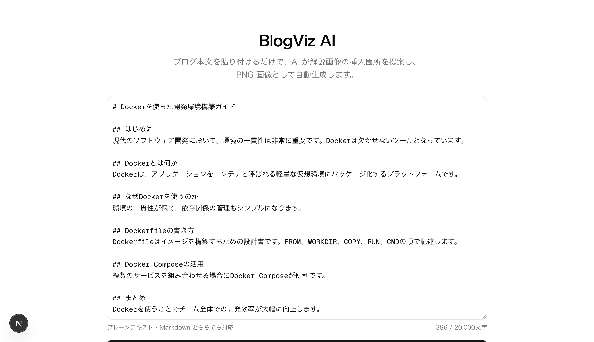
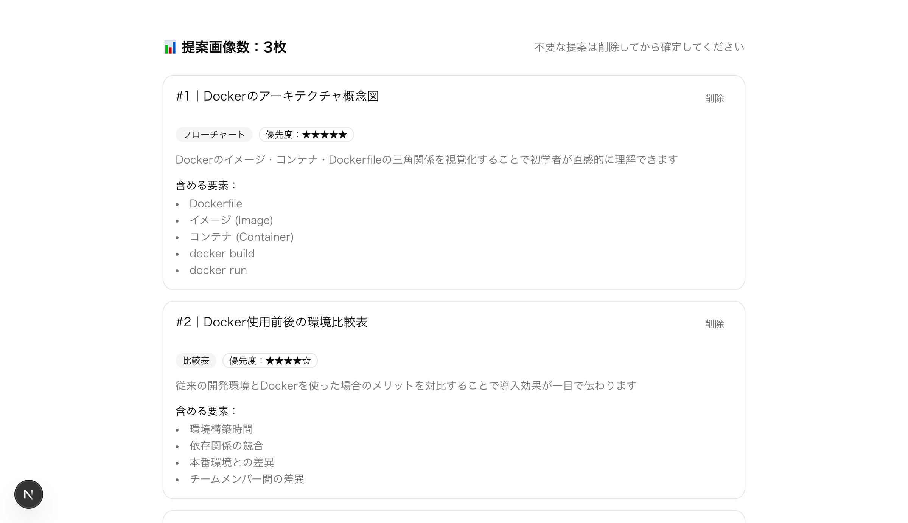
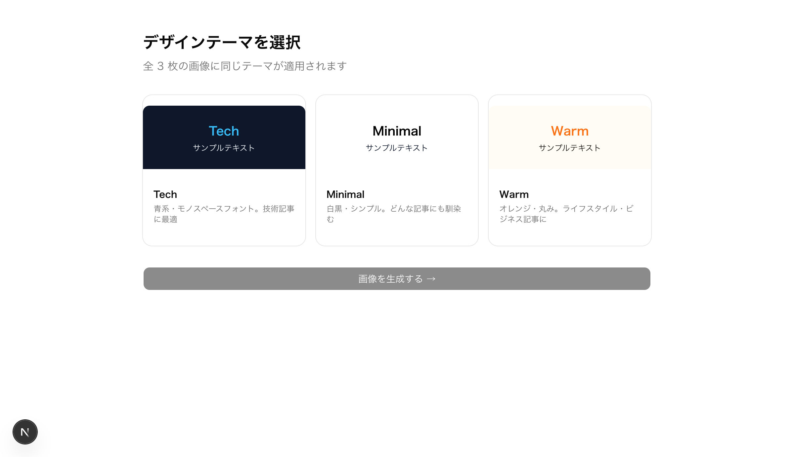
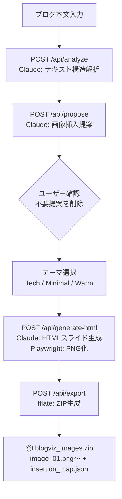

# 🤖 BlogViz AI

[](https://opensource.org/licenses/MIT)
[](https://www.typescriptlang.org/)
[](https://nextjs.org/)
[](https://www.docker.com/)

> **ブログ本文を貼り付けるだけで、AI が解説画像の挿入箇所を提案し PNG 画像として自動生成するツール**




## 📖 概要

BlogViz AI は、文章だけのブログ記事に解説画像を手軽に追加したいブロガー・テクニカルライター向けのツールです。
ブログ本文を貼り付けると、AI がセクションを解析して「どこにどんな図を入れるべきか」を提案し、HTML スライドを自動生成 → PNG 画像として書き出します。

### なぜ作ったのか

- 画像を作る時間・スキルがないが、文章だけの記事は読みにくい
- 毎回 Figma や PowerPoint で図を作るのが面倒
- 挿入位置まで指定してくれるツールが存在しなかった

## ✨ 主な機能

- **AI 解析**: ブログ本文をセクション分割し、視覚化すべき箇所をスコアリング
- **画像提案**: 「フローチャート / 比較表 / ステップ図 / 概念図 / コード解説」を自動判定して提案カードで表示
- **提案の編集**: 不要な提案を削除してから生成できる確認ステップ付き
- **3 テーマ対応**: Tech（青系）/ Minimal（白黒）/ Warm（オレンジ）から選択
- **ZIP 出力**: `image_01.png` 〜 `image_N.png` + 挿入位置マップ JSON をまとめてダウンロード
- **マルチ AI 対応**: Claude / ChatGPT / Gemini を環境変数で切り替え可能

## 🖼 スクリーンショット

| STEP 1：テキスト入力 | STEP 2-3：AI 提案カード |
|:--:|:--:|
|  |  |

| STEP 3：テーマ選択 |
|:--:|
|  |

## 🛠 技術スタック

| カテゴリ | 技術 |
|:--|:--|
| フロントエンド | Next.js 15 (App Router), TypeScript, Tailwind CSS v4, shadcn/ui |
| 状態管理 | Zustand (sessionStorage persist) |
| AI エンジン | Claude API / OpenAI API / Gemini API（切り替え可能） |
| スクリーンショット | playwright-core + システム Chromium |
| ZIP 生成 | fflate |
| インフラ | Docker, Railway |

## 🏗 アーキテクチャ



詳細は [docs/architecture.md](docs/architecture.md) を参照してください。

## 🚀 はじめ方

### 前提条件

- Docker（推奨）または Node.js 20+
- いずれかの AI プロバイダの API キー
  - [Anthropic](https://console.anthropic.com/)（Claude）
  - [OpenAI](https://platform.openai.com/)（ChatGPT）
  - [Google AI Studio](https://aistudio.google.com/)（Gemini）

### Docker でのセットアップ（推奨）

```bash
# リポジトリをクローン
git clone https://github.com/ryusei2790/blog-viz-ai.git
cd blog-viz-ai

# 環境変数を設定
cp .env.local.example .env.local
# .env.local を開いて API キーを記入

# ビルド・起動
docker build -t blog-viz-ai .
docker run -p 3000:3000 --env-file .env.local blog-viz-ai
```

### ローカル開発（Next.js dev server）

```bash
npm install
cp .env.local.example .env.local
# .env.local を編集

npm run dev
```

`http://localhost:3000` でアクセスできます。

### 環境変数

```bash
# AI プロバイダを選択（anthropic / openai / gemini）
AI_PROVIDER=anthropic

# 選択したプロバイダの API キーを設定
ANTHROPIC_API_KEY=sk-ant-...
# OPENAI_API_KEY=sk-...
# GEMINI_API_KEY=...

# Chromium のパス（Docker 内は自動設定済み）
# ローカルの場合: /opt/homebrew/bin/chromium など
CHROMIUM_PATH=/usr/bin/chromium
```

## 📤 出力ファイル

ZIP ファイルには以下が含まれます：

| ファイル | 内容 |
|:--|:--|
| `image_01.png` 〜 `image_N.png` | AI が生成した解説画像（800×450px, PNG） |
| `insertion_map.json` | 各画像をどのセクションのどの位置に挿入するかのガイド |

```json
{
  "version": "1.0",
  "items": [
    {
      "imageFilename": "image_01.png",
      "sectionHeading": "TypeScriptとは",
      "insertPosition": "before",
      "paragraphIndex": 0,
      "visualType": "flowchart",
      "priority": 5
    }
  ]
}
```

## 📄 ライセンス

このプロジェクトは [MIT License](LICENSE) の下で公開されています。
