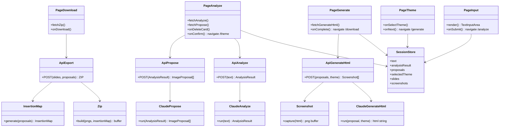

# BlogViz AI — アーキテクチャ設計書

**バージョン：** 1.1.0
**作成日：** 2026-03-21
**更新日：** 2026-03-29（ブロック番号統一・API出力仕様・Playwright MCP → playwright-core 統一）
**ステータス：** 確定（Phase 2）

---

## 1. ディレクトリ構成

```
blog-viz-ai/
├── app/                          # Next.js App Router
│   ├── layout.tsx                # ルートレイアウト（フォント・共通 head）
│   ├── page.tsx                  # STEP 1：テキスト入力画面（エントリポイント）
│   ├── analyze/
│   │   └── page.tsx              # STEP 2-3：解析中 → 提案レポート表示
│   ├── theme/
│   │   └── page.tsx              # STEP 4：デザインテーマ選択
│   ├── generate/
│   │   └── page.tsx              # STEP 5-6：生成中 → プレビュー
│   └── download/
│       └── page.tsx              # STEP 7：ZIP ダウンロード完了
│
├── app/api/                      # Next.js API Routes（サーバーサイド処理）
│   ├── analyze/
│   │   └── route.ts              # POST: テキスト解析 → AnalysisResult
│   ├── propose/
│   │   └── route.ts              # POST: 画像提案生成 → ImageProposal[]
│   ├── generate-html/
│   │   └── route.ts              # POST: HTMLスライド生成 + スクリーンショット
│   └── export/
│       └── route.ts              # POST: ZIP生成 → ダウンロード
│
├── components/                   # UIコンポーネント
│   ├── ui/                       # shadcn/ui が自動生成するファイル群
│   ├── TextInputArea.tsx         # テキスト入力エリア（文字数カウント付き）
│   ├── ProposalCard.tsx          # 提案カード（削除ボタン付き）
│   ├── ProposalList.tsx          # 提案カード一覧 + 確認ボタン
│   ├── ThemeSelector.tsx         # デザインテーマ選択 UI
│   ├── GenerationProgress.tsx    # 生成中プログレスバー
│   ├── ImagePreview.tsx          # 生成済み PNG プレビュー
│   └── DownloadButton.tsx        # ZIP ダウンロードボタン
│
├── lib/                          # ビジネスロジック
│   ├── claude/
│   │   ├── client.ts             # Anthropic SDK クライアント初期化
│   │   ├── analyze.ts            # プロンプト①：テキスト構造解析
│   │   ├── propose.ts            # プロンプト②：画像提案生成
│   │   └── generateHtml.ts       # プロンプト③：HTMLスライド生成
│   ├── screenshot.ts             # playwright-core でサーバー上でスクリーンショット取得
│   ├── zip.ts                    # fflate を使った ZIP 生成
│   └── insertionMap.ts           # insertion_map.json 生成
│
├── types/
│   └── index.ts                  # 全型定義（BlogInput / Section / ImageProposal 等）
│
├── themes/                       # デザインテーマ CSS
│   ├── tech.css                  # Tech テーマ（青系・モノスペース）
│   ├── minimal.css               # Minimal テーマ（白黒・シンプル）
│   └── warm.css                  # Warm テーマ（オレンジ・丸み）
│
├── store/
│   └── sessionStore.ts           # Zustand：セッション状態管理（入力〜出力まで）
│
├── Dockerfile                    # Railway デプロイ用（日本語フォント + Playwright 込み）
├── .dockerignore
├── public/                       # 静的アセット
└── docs/                         # ドキュメント群
```

---

## 2. 各ファイルの役割と責務

### app/ 層（画面）

| ファイル | 役割 |
|----------|------|
| `app/page.tsx` | テキスト入力。バリデーション後にストアへ保存して `/analyze` へ遷移 |
| `app/analyze/page.tsx` | API を呼んで解析・提案を実行。カード一覧表示。削除・確認操作 |
| `app/theme/page.tsx` | テーマ選択 UI。選択結果をストアへ保存して `/generate` へ遷移 |
| `app/generate/page.tsx` | HTML生成・スクリーンショットをAPI経由で実行。プログレス表示 |
| `app/download/page.tsx` | ZIP ダウンロードボタンと画像プレビュー一覧 |

### app/api/ 層（APIルート）

| ファイル | メソッド | 入力 | 出力 |
|----------|---------|------|------|
| `api/analyze/route.ts` | POST | `{ text: string }` | `AnalysisResult` JSON |
| `api/propose/route.ts` | POST | `AnalysisResult` | `ImageProposal[]` JSON |
| `api/generate-html/route.ts` | POST | `{ proposals: ImageProposal[], theme: ThemeName }` | `{ proposalId, filename, pngBase64 }[]` JSON（HTML生成 + スクリーンショット両方を担う） |
| `api/export/route.ts` | POST | `{ slides: GeneratedSlide[], proposals: ImageProposal[] }` | ZIP バイナリ |

### lib/ 層（ビジネスロジック）

| ファイル | 役割 |
|----------|------|
| `lib/claude/client.ts` | `new Anthropic()` の初期化。環境変数チェック |
| `lib/claude/analyze.ts` | プロンプト①を組み立てて Claude に送信。JSON レスポンスをパース |
| `lib/claude/propose.ts` | プロンプト②を組み立てて Claude に送信。JSON レスポンスをパース |
| `lib/claude/generateHtml.ts` | プロンプト③を組み立てて Claude に送信。HTML文字列を返す |
| `lib/screenshot.ts` | `playwright-core` を使いサーバー上でブラウザを起動し HTML → PNG を取得 |
| `lib/zip.ts` | fflate で PNG + JSON を ZIP にまとめてバイナリを返す |
| `lib/insertionMap.ts` | `ImageProposal[]` から `InsertionMap` JSON を生成 |

---

## 3. モジュール間の依存関係



---

## 4. データの流れ

```
[ユーザー入力]
    text: string (最大20,000文字)
        │
        ▼
[API: /api/analyze]
    lib/claude/analyze.ts
    → Claude API (プロンプト①)
    → AnalysisResult { theme, tone, sections[] }
        │
        ▼
[API: /api/propose]
    lib/claude/propose.ts
    → Claude API (プロンプト②)
    → ImageProposal[] (各提案: 位置・タイプ・理由・優先度)
        │
        ▼ (ユーザーが不要カードを削除して確認)
        │
[ユーザーがテーマ選択]
    ThemeName: 'tech' | 'minimal' | 'warm'
        │
        ▼
[API: /api/generate-html]
    lib/claude/generateHtml.ts (提案ごとにループ)
    → Claude API (プロンプト③)
    → GeneratedSlide[] { id, html }
    lib/screenshot.ts
    → playwright-core（サーバー上で Chromium 起動）
    → { proposalId, filename, pngBase64 }[]
        │
        ▼
[API: /api/export]
    lib/insertionMap.ts → InsertionMap JSON
    lib/zip.ts (fflate)
    → image_01.png 〜 image_N.png + insertion_map.json
    → blogviz_images.zip (バイナリ)
        │
        ▼
[ユーザーへ返却]
    ZIP ダウンロード
```

---

## 5. セッション状態管理（Zustand）

```typescript
interface SessionState {
  // STEP 1
  rawText: string;
  // STEP 2-3
  analysisResult: AnalysisResult | null;
  proposals: ImageProposal[];          // 削除操作で減る
  // STEP 4
  selectedTheme: ThemeName | null;
  // STEP 5-6
  slides: GeneratedSlide[];
  screenshots: { proposalId: string; pngBase64: string; filename: string }[];
  // Actions
  setText: (text: string) => void;
  setAnalysisResult: (result: AnalysisResult) => void;
  setProposals: (proposals: ImageProposal[]) => void;
  removeProposal: (id: string) => void;
  setTheme: (theme: ThemeName) => void;
  addSlide: (slide: GeneratedSlide) => void;
  addScreenshot: (s: Screenshot) => void;
  reset: () => void;
}

type ThemeName = 'tech' | 'minimal' | 'warm';
```

---

## 6. Claude API プロンプト設計

### プロンプト① — テキスト構造解析

```
システム：
あなたはブログ記事の構造を分析するエキスパートです。
与えられた記事テキストを分析し、以下のJSONを返してください。
必ず有効なJSONのみを返し、説明文は含めないこと。

ユーザー：
[記事全文テキスト]

出力形式：
{
  "theme": "記事のテーマ（例：TypeScript入門）",
  "tone": "technical | lifestyle | business | other",
  "sections": [
    {
      "id": "s1",
      "heading": "見出し",
      "body": "本文",
      "contentType": "steps | concept | comparison | data | case",
      "visualScore": 8,
      "orderIndex": 0
    }
  ]
}
```

### プロンプト② — 画像提案生成

```
システム：
あなたはブログ記事に最適な解説画像を提案するエキスパートです。
与えられた解析結果をもとに、視覚化すべき箇所を特定してJSONを返してください。
必ず有効なJSONのみを返し、説明文は含めないこと。

ユーザー：
[AnalysisResult JSON]

出力形式：
[
  {
    "id": "p1",
    "sectionId": "s1",
    "insertPosition": "before | after",
    "paragraphIndex": 0,
    "visualType": "flowchart | comparison | steps | concept | code",
    "reason": "なぜここに画像が必要か",
    "priority": 5,
    "content": {
      "title": "図のタイトル",
      "elements": ["要素1", "要素2"]
    }
  }
]
```

### プロンプト③ — HTMLスライド生成

```
システム：
あなたはHTMLスライド生成エキスパートです。
以下の仕様を満たす完全なHTMLファイルを1つ返してください。
- サイズ：width: 800px, height: 450px（固定）
- 文字エンコード：UTF-8
- 日本語フォント：Noto Sans JP（Google Fonts CDN経由）
- テーマ：[選択されたテーマ名]
- 内容：与えられた提案の内容を図解で表現
- HTMLのみを返すこと（```html などのコードブロックは不要）

ユーザー：
[ImageProposal JSON]
```

---

## 7. テーマ設計（CSS 変数）

3テーマは共通の CSS 変数名を使い、テーマファイルの切り替えだけで見た目が変わる設計：

```css
/* 共通変数（すべてのテーマが定義する） */
:root {
  --bg-primary: ...;
  --bg-secondary: ...;
  --text-primary: ...;
  --text-secondary: ...;
  --accent: ...;
  --border: ...;
  --font-family: ...;
  --border-radius: ...;
}
```

| 変数 | Tech | Minimal | Warm |
|------|------|---------|------|
| `--bg-primary` | `#0f172a`（ダークネイビー） | `#ffffff` | `#fffbf5` |
| `--accent` | `#38bdf8`（水色） | `#000000` | `#f97316`（オレンジ） |
| `--font-family` | `'JetBrains Mono', monospace` | `'Noto Sans JP', sans-serif` | `'Noto Sans JP', sans-serif` |
| `--border-radius` | `4px` | `0px` | `16px` |

---

## 8. インフラ構成（Railway + Docker）

### Dockerfile 設計方針

Vercel の Serverless は Playwright（Chromium）を動かせないため、**Railway に Docker でデプロイ**する。
Dockerfile には以下を含める：

```dockerfile
FROM node:20-slim

# Chromium と日本語フォントのインストール
RUN apt-get update && apt-get install -y \
    chromium \　　
    fonts-noto-cjk \
    fonts-ipafont-gothic \
    --no-install-recommends \
    && rm -rf /var/lib/apt/lists/*

# Playwright が Chromium を見つけられるよう環境変数を設定
ENV PLAYWRIGHT_SKIP_BROWSER_DOWNLOAD=1
ENV CHROMIUM_PATH=/usr/bin/chromium

WORKDIR /app
COPY package*.json ./
RUN npm ci
COPY . .
RUN npm run build

CMD ["npm", "start"]
```

### `lib/screenshot.ts` の実装方針

```typescript
// playwright-core を使い、Dockerfile でインストール済みの
// システム Chromium を executablePath で指定して起動する
import { chromium } from 'playwright-core';

export async function captureHtml(html: string): Promise<Buffer> {
  const browser = await chromium.launch({
    executablePath: process.env.CHROMIUM_PATH ?? '/usr/bin/chromium',
    args: ['--no-sandbox', '--disable-setuid-sandbox'],
  });
  // ...
}
```

### クラウド互換性マップ（更新）

```
ローカル環境                      → Railway（Docker）
──────────────────────────────────────────────────────
Next.js 15 (next dev)            → next start（Docker内）
Anthropic SDK                    → 環境変数 ANTHROPIC_API_KEY
playwright-core + システムChromium → Dockerfile で apt-get インストール済み
日本語フォント (Noto CJK / IPA)  → Dockerfile で apt-get インストール済み
fflate（ZIP）                    → Node.js 環境で動作（変更なし）
```

---

## 9. 設計の自己レビュー

### 懸念点

- **Railway の無料枠とメモリ**：Playwright（Chromium）は起動時に 200〜400MB のメモリを使う。Railway の無料プランは 512MB のため、10枚同時生成時にメモリ不足になる可能性がある。有料プラン（$5/月〜）を検討。
- **状態管理の永続性**：Zustand はメモリ内ステートのため、ページリロードで状態が消える。MVP では許容するが `sessionStorage` パーシストを検討。
- **ZIP ダウンロードサイズ**：10枚 × 1600×900px PNG = 最大 30〜50MB 程度。ブラウザメモリへの影響を確認が必要。

### 拡張性へのリスク

- Claude API のモデルを `claude-sonnet-4-6` に固定しているため、モデル変更時は `lib/claude/client.ts` 1ファイルの修正で済む設計にしておく。
- テーマを追加する場合、`themes/` に CSS ファイルを追加するだけで対応できる構造。

### 推奨する対策

- Playwright の起動はリクエストごとに 1ブラウザ起動 → 完了後即クローズ（メモリ解放）。ブラウザプールは MVP では不要。
- Zustand store に `persist` ミドルウェア（`sessionStorage`）を当初から設定しておく。
- PNG は Buffer のままで処理し、ZIP 生成直前まで Base64 変換しない（メモリ効率）。
