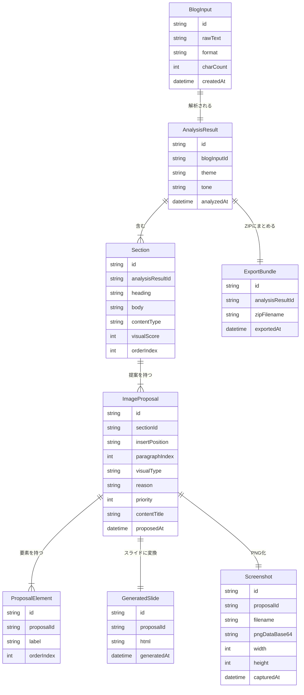

# BlogViz AI — データモデル定義書

**バージョン：** 1.1.0
**作成日：** 2026-03-20
**更新日：** 2026-03-29（Screenshot.slideId → proposalId に修正）

---

## ER 図



---

## 型定義（TypeScript）

### 入力

```typescript
/** ユーザーが貼り付けたブログ全文 */
interface BlogInput {
  id: string;
  rawText: string;
  format: 'plaintext' | 'markdown';
  charCount: number;
  createdAt: Date;
}
```

### 解析結果

```typescript
/** AI によるテキスト構造解析の結果 */
interface AnalysisResult {
  id: string;
  blogInputId: string;
  theme: string;
  tone: 'technical' | 'lifestyle' | 'business' | 'other';
  sections: Section[];
  analyzedAt: Date;
}

/** セクション（見出し単位の意味的ブロック） */
interface Section {
  id: string;
  heading: string;
  body: string;
  contentType: ContentType;
  /** 視覚化で理解度が上がる度合い 0〜10 */
  visualScore: number;
  orderIndex: number;
}

type ContentType = 'steps' | 'concept' | 'comparison' | 'data' | 'case';
```

### 画像提案

```typescript
/** AI による画像挿入提案 */
interface ImageProposal {
  id: string;
  sectionId: string;
  /** セクション内の挿入位置 */
  insertPosition: 'before' | 'after';
  /** 段落インデックス（0始まり） */
  paragraphIndex: number;
  visualType: VisualType;
  reason: string;
  /** 優先度 1（低）〜 5（高） */
  priority: 1 | 2 | 3 | 4 | 5;
  content: {
    title: string;
    /** 図に含めるべきラベル・要素 */
    elements: string[];
  };
  proposedAt: Date;
}

type VisualType =
  | 'flowchart'   // フローチャート・処理フロー
  | 'comparison'  // 比較表・対比
  | 'steps'       // 番号付きステップ
  | 'concept'     // 概念図・関係図
  | 'code';       // コード解説図
```

### HTML スライド・スクリーンショット

```typescript
/** AI が生成した HTML スライド */
interface GeneratedSlide {
  id: string;
  proposalId: string;
  html: string;
  generatedAt: Date;
}

/** playwright-core（サーバー上の Chromium）で撮影した PNG */
interface Screenshot {
  id: string;
  proposalId: string;
  /** 出力ファイル名 例: image_01.png */
  filename: string;
  pngDataBase64: string;
  width: number;
  height: number;
  capturedAt: Date;
}
```

### 出力バンドル

```typescript
/** ZIP ダウンロード用バンドル（PNG群 + insertion_map.json のみ） */
interface ExportBundle {
  id: string;
  analysisResultId: string;
  screenshots: Screenshot[];
  insertionMap: InsertionMap;
  exportedAt: Date;
}

/** 挿入位置マップ（JSON 出力用） */
interface InsertionMap {
  version: '1.0';
  items: InsertionMapItem[];
}

interface InsertionMapItem {
  imageFilename: string;
  sectionHeading: string;
  insertPosition: 'before' | 'after';
  paragraphIndex: number;
  visualType: VisualType;
  priority: number;
}
```
