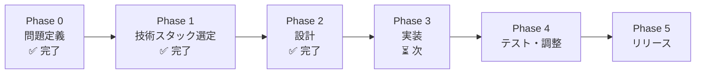

# BlogViz AI — プロジェクト計画書

**バージョン：** 1.2.0
**作成日：** 2026-03-21
**更新日：** 2026-03-23
**ステータス：** 確定（Phase 3 進行前）

---

## 1. フェーズ全体像



---

## 2. フェーズ別タスク

### Phase 0：問題定義 ✅ 完了

- [x] ペイン抽出・ターゲット明確化
- [x] ツール概念定義
- [x] Q1〜Q4 確認・確定
- [x] 要件定義書作成（`docs/requirements.md`）
- [x] システムフロー設計書作成（`docs/system_flow.md`）
- [x] データモデル定義書作成（`docs/data_models.md`）

---

### Phase 1：技術スタック選定 ✅ 完了

**確定した技術スタック：**

| カテゴリ | 採用技術 | 決定理由 |
|----------|---------|---------|
| フロントエンド | Next.js 15（App Router） | API Routes でバックエンドと一体化。Vercel/Railway 対応 |
| UI | shadcn/ui + Tailwind CSS v4 | 提案カード・テーマ切替UIを高品質に即実装できる |
| AI エンジン | Claude API（claude-sonnet-4-6）+ Anthropic SDK | 速度・コスト・品質のバランス最良 |
| スクリーンショット | playwright-core + システム Chromium | サーバー上で直接 Chromium を動かす唯一の選択肢 |
| ZIP 生成 | fflate | 最速・型定義完備・Node.js 環境で動作 |
| デプロイ | Railway（Docker コンテナ） | Playwright が動く Docker 環境をそのままデプロイ可能 |
| コンテナ | Docker（Chromium + 日本語フォント込み） | Vercel Serverless では Playwright が動かないため |

---

### Phase 2：設計 ✅ 完了

**成果物：**

| ドキュメント | 内容 |
|-------------|------|
| `docs/architecture.md` | ディレクトリ構成・依存関係・プロンプト設計・Dockerfile 設計 |
| `docs/ui_wireframe.md` | 7画面のワイヤーフレーム・画面遷移図 |
| `docs/system_flow.md` | 処理ブロック定義・Mermaid フロー図 |
| `docs/data_models.md` | ER 図・TypeScript 型定義 |

---

### Phase 3：実装 ⏳ 次のフェーズ

**目的：** 設計に基づいてコードを書く

#### 実装順序（依存関係順）

```
1. プロジェクト初期設定（フレームワーク・lint・フォーマッタ）
   ↓
2. 型定義ファイル（data_models.md の型を実装）
   ↓
3. Claude API クライアント（解析・提案・HTML生成 の3プロンプト）
   ↓
4. テキスト入力コンポーネント
   ↓
5. 提案レポート表示コンポーネント（カード + 削除UI）
   ↓
6. テーマ選択コンポーネント
   ↓
7. playwright-core スクリーンショット処理（lib/screenshot.ts）
   ↓
8. ZIP 生成・ダウンロード処理
   ↓
9. ページ全体の統合（ステップ遷移 UI）
```

#### 実装ルール
- ファイルを作成・変更するたびに解説ドキュメントを `docs/explanations/` に生成
- 各ファイルに責務コメント・設計意図コメントを必ず記載
- ユーザーが「承認」するまで次のファイルに進まない

---

### Phase 4：テスト・調整 ⏳ 未着手

**目的：** 実際のブログ記事でE2Eテストを行い品質を確認する

#### タスク
- [ ] 日本語ブログ記事（技術系・ライフスタイル系・ビジネス系）で動作確認
- [ ] 英語ブログ記事での動作確認
- [ ] 日本語フォントの文字化けゼロ確認
- [ ] 生成時間計測（提案まで 10秒以内・画像1枚 5秒以内）
- [ ] 10枚同時生成の動作確認
- [ ] ZIP ダウンロード・`insertion_map.json` の内容確認

---

### Phase 5：リリース ⏳ 未着手

**目的：** 本番環境へデプロイ

#### タスク
- [ ] Railway プロジェクト作成
- [ ] Dockerfile のビルド確認（ローカル docker build）
- [ ] Railway に環境変数（`ANTHROPIC_API_KEY` 等）を設定
- [ ] Railway へ Docker イメージをデプロイ
- [ ] 本番 URL での動作確認

---

## 3. 重要な技術的注意点

### playwright-core と日本語フォント

`playwright-core` でスクリーンショットを撮る際、日本語フォントが適用されていないと文字化けが発生する。
Railway の Docker コンテナでは **Dockerfile でフォントを apt-get インストール**することで根本解決する：

```dockerfile
RUN apt-get install -y fonts-noto-cjk fonts-ipafont-gothic
```

HTML 内にも Google Fonts CDN を埋め込み、2層でフォールバックする：

```
優先度1：Dockerfile でインストール済みのシステムフォント（Noto CJK / IPA）
   ↓ ローカルフォントが見つからない場合
優先度2：Google Fonts CDN (@import Noto Sans JP)
```

### Claude API プロンプトの設計方針

3種類のプロンプトを独立して設計する：

| プロンプト種別 | 入力 | 出力形式 |
|---------------|------|---------|
| 解析プロンプト | ブログ全文テキスト | `AnalysisResult` JSON |
| 提案プロンプト | `AnalysisResult` | `ImageProposal[]` JSON |
| HTML生成プロンプト | `ImageProposal` + テーマ名 | HTML 文字列 |

出力は必ず JSON / HTML の構造化フォーマットで受け取る（パースエラー対策）。

---

## 4. リスクと対策

| リスク | 深刻度 | 対策 |
|--------|--------|------|
| Claude API の出力が JSON として不正 | 高 | JSON バリデーション + リトライ（最大1回）を実装 |
| Playwright で日本語が文字化け | 高 | Dockerfile で fonts-noto-cjk / fonts-ipafont-gothic をインストール |
| Railway のメモリ不足（Chromium は 200〜400MB使用）| 中 | 有料プランを検討。リクエストごとにブラウザを起動→即クローズしてメモリ解放 |
| HTML生成が指定サイズ（800×450）からずれる | 中 | CSS で `width/height` を `!important` で固定 |
| 20,000文字超のテキストでAPIコスト増大 | 中 | 入力時点でバリデーション。超過分はカット案内 |
| 10枚同時生成でタイムアウト | 中 | 並列処理（Promise.all）+ 個別タイムアウト設定 |

---

## 5. ドキュメント管理

| ドキュメント | パス | 更新タイミング |
|-------------|------|--------------|
| 要件定義書 | `docs/requirements.md` | 要件変更時 |
| システムフロー | `docs/system_flow.md` | 設計変更時 |
| データモデル | `docs/data_models.md` | 型定義変更時 |
| プロジェクト計画書 | `docs/project_plan.md` | フェーズ進捗時 |
| ファイル解説群 | `docs/explanations/*.md` | ファイル作成・変更時 |
| 単語帳 | `/Users/ryusei/Mywork/docs/glossary.md` | 新用語登場時 |
| プロジェクトログ | `/Users/ryusei/Mywork/docs/project_log.md` | 実装・決定時 |
| 学習日記 | `/Users/ryusei/Mywork/docs/learning_diary.md` | 承認・解決時 |
