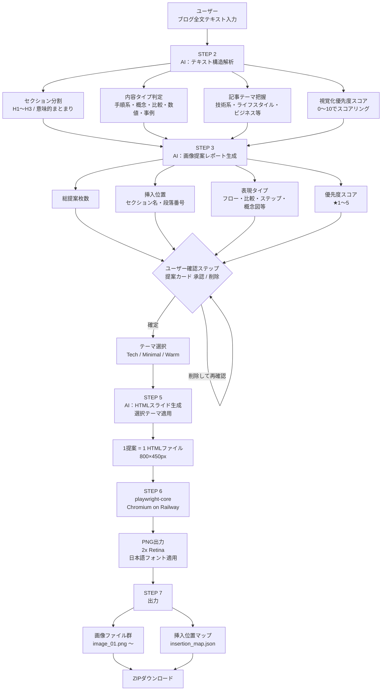

# BlogViz AI — システムフロー設計書

**バージョン：** 1.1.0
**作成日：** 2026-03-20
**更新日：** 2026-03-23

---

## 全体フロー図



---

## 処理ブロック定義

### ブロック 1：テキスト入力

| 項目 | 内容 |
|------|------|
| 入力データ | プレーンテキスト / Markdown（最大 20,000文字） |
| 処理内容 | 入力値バリデーション（文字数チェック・空白チェック） |
| 出力データ | バリデーション済みテキスト文字列 |
| 次のブロック | AI テキスト構造解析 |

### ブロック 2：AI テキスト構造解析

| 項目 | 内容 |
|------|------|
| 入力データ | ブログ全文テキスト |
| 処理内容 | Claude API へプロンプト送信 → セクション分割・タイプ判定・スコアリング |
| 出力データ | `AnalysisResult`（セクション配列・タイプ・スコア） |
| 次のブロック | 画像提案レポート生成 |

```typescript
interface Section {
  id: string;
  heading: string;
  body: string;
  contentType: 'steps' | 'concept' | 'comparison' | 'data' | 'case';
  visualScore: number; // 0〜10
}

interface AnalysisResult {
  theme: string;
  tone: 'technical' | 'lifestyle' | 'business' | 'other';
  sections: Section[];
}
```

### ブロック 3：画像提案レポート生成

| 項目 | 内容 |
|------|------|
| 入力データ | `AnalysisResult` |
| 処理内容 | Claude API へプロンプト送信 → 挿入位置・表現タイプ・理由を生成 |
| 出力データ | `ImageProposal[]` |
| 次のブロック | ユーザー確認（または直接 HTML 生成） |

```typescript
interface ImageProposal {
  id: string;
  sectionId: string;
  insertPosition: 'before' | 'after';
  paragraphIndex: number;
  visualType: 'flowchart' | 'comparison' | 'steps' | 'concept' | 'code';
  reason: string;
  priority: 1 | 2 | 3 | 4 | 5;
  content: {
    title: string;
    elements: string[]; // 図に含めるべき要素・ラベル
  };
}
```

### ブロック 4：テーマ選択（ユーザー操作）

| 項目 | 内容 |
|------|------|
| 入力データ | ユーザーのクリック操作 |
| 処理内容 | Tech / Minimal / Warm の3テーマから1つを選択 |
| 出力データ | `ThemeName: 'tech' \| 'minimal' \| 'warm'` |
| 次のブロック | HTML スライド生成 |

### ブロック 5：HTML スライド生成

| 項目 | 内容 |
|------|------|
| 入力データ | `ImageProposal[]` + `ThemeName` |
| 処理内容 | Claude API へプロンプト送信 → 各提案に対応するHTMLを生成（テーマ適用済み） |
| 出力データ | `GeneratedSlide[]`（`{ id: string; html: string }[]`） |
| 次のブロック | playwright-core スクリーンショット |

### ブロック 6：playwright-core スクリーンショット

| 項目 | 内容 |
|------|------|
| 入力データ | `GeneratedSlide[]`（HTML 文字列配列） |
| 処理内容 | Railway の Docker コンテナ上で Chromium を起動 → HTML を開く → スクリーンショット取得 → ブラウザをクローズ |
| 出力データ | PNG Buffer 配列（`proposalId` で紐付け） |
| 次のブロック | 出力・ZIP 生成 |

### ブロック 7：出力・ZIP 生成

| 項目 | 内容 |
|------|------|
| 入力データ | PNG Buffer 配列 + `ImageProposal[]` |
| 処理内容 | fflate で ZIP 生成（画像群 + `insertion_map.json`） |
| 出力データ | ZIP ファイル（ダウンロード） |
| 次のブロック | ユーザーへ返却（完了） |

---

## エラーハンドリング方針

| エラーケース | 対応 |
|-------------|------|
| テキスト 20,000文字超過 | 入力時点でバリデーションエラーを表示 |
| AI API タイムアウト（10秒超過） | リトライ 1回 → 失敗時エラーメッセージ表示 |
| HTML スライド生成失敗 | 該当スライドをスキップし、他の処理を継続 |
| Playwright スクリーンショット失敗 | HTML ファイルをそのまま出力に含める |
| 日本語フォント未適用 | Google Fonts CDN → ローカルフォントのフォールバック順 |
