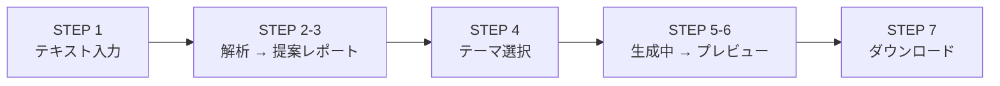

# BlogViz AI — UI ワイヤーフレーム

**バージョン：** 1.0.0
**作成日：** 2026-03-21

---

## 画面遷移図



---

## STEP 1 — テキスト入力画面（`app/page.tsx`）

```
┌─────────────────────────────────────────────────────┐
│  BlogViz AI                                         │
│  ブログ解説画像 自動生成ツール                         │
├─────────────────────────────────────────────────────┤
│                                                     │
│  ブログ全文を貼り付けてください                        │
│  ┌───────────────────────────────────────────────┐  │
│  │                                               │  │
│  │  （テキストエリア）                             │  │
│  │  ・プレーンテキスト / Markdown どちらでも可      │  │
│  │  ・最大 20,000文字                             │  │
│  │                                               │  │
│  │                                               │  │
│  └───────────────────────────────────────────────┘  │
│  12,345 / 20,000文字                                │
│                                                     │
│       [ 解析して画像を提案する → ]                   │
│                                                     │
└─────────────────────────────────────────────────────┘
```

**コンポーネント：**
- `TextInputArea` — テキストエリア + 文字数カウンター
- ボタン：`Button`（shadcn/ui）— クリックで `/analyze` へ遷移

---

## STEP 2-3 — 解析 → 提案レポート画面（`app/analyze/page.tsx`）

### 解析中（ローディング状態）

```
┌─────────────────────────────────────────────────────┐
│  解析中...                                           │
│                                                     │
│       ████████░░░░░░░░░░  40%                       │
│       テキスト構造を解析しています                    │
│                                                     │
└─────────────────────────────────────────────────────┘
```

### 提案レポート表示（完了状態）

```
┌─────────────────────────────────────────────────────┐
│  📊 提案レポート — 全 4 枚                           │
│  不要な提案は削除してから「画像を生成する」を押してください │
├─────────────────────────────────────────────────────┤
│                                                     │
│  ┌─────────────────────────────────────────────┐    │
│  │ 画像 #1                          [削除 ×]   │    │
│  │ 挿入位置：「インストール手順」の冒頭          │    │
│  │ 表現タイプ：フローチャート                    │    │
│  │ 理由：5ステップの全体像を図で示すと...        │    │
│  │ 優先度：★★★★★                             │    │
│  └─────────────────────────────────────────────┘    │
│                                                     │
│  ┌─────────────────────────────────────────────┐    │
│  │ 画像 #2                          [削除 ×]   │    │
│  │ 挿入位置：「設定ファイル」段落2の後           │    │
│  │ 表現タイプ：対応関係マッピング図              │    │
│  │ 理由：コードと設定値の対応関係を...           │    │
│  │ 優先度：★★★★☆                             │    │
│  └─────────────────────────────────────────────┘    │
│                                                     │
│  （...以下続く...）                                  │
│                                                     │
│       [ この内容で画像を生成する → ]                 │
│                                                     │
└─────────────────────────────────────────────────────┘
```

**コンポーネント：**
- `GenerationProgress` — ローディングバー
- `ProposalList` — カード一覧コンテナ
- `ProposalCard` — 各カード（削除ボタン付き）
- ボタン：`Button` — 確認後に `/theme` へ遷移

---

## STEP 4 — デザインテーマ選択画面（`app/theme/page.tsx`）

```
┌─────────────────────────────────────────────────────┐
│  デザインテーマを選択してください                     │
│  全ての画像に同じテーマが適用されます                  │
├─────────────────────────────────────────────────────┤
│                                                     │
│  ┌──────────────┐  ┌──────────────┐  ┌───────────┐  │
│  │   ████████   │  │              │  │  ░░░░░░░  │  │
│  │   Tech       │  │   Minimal    │  │   Warm    │  │
│  │   青系・技術 │  │   白黒・簡潔  │  │  暖色・丸み│  │
│  │              │  │              │  │           │  │
│  │  [選択中 ✓] │  │  [ 選択する ] │  │ [ 選択する]│  │
│  └──────────────┘  └──────────────┘  └───────────┘  │
│                                                     │
│       [ 画像を生成する → ]                           │
│                                                     │
└─────────────────────────────────────────────────────┘
```

**コンポーネント：**
- `ThemeSelector` — 3つのテーマカード（選択状態をハイライト）
- ボタン：`Button` — 選択後に `/generate` へ遷移

---

## STEP 5-6 — 生成中 → プレビュー画面（`app/generate/page.tsx`）

### 生成中

```
┌─────────────────────────────────────────────────────┐
│  画像を生成しています...                              │
│                                                     │
│  ████████████░░░░░░░░  3 / 4 枚完了                 │
│                                                     │
│  ┌──────────┐  ┌──────────┐  ┌──────────┐  ┌─────┐ │
│  │ image_01 │  │ image_02 │  │ image_03 │  │ ... │ │
│  │  ✅完了   │  │  ✅完了   │  │  ✅完了   │  │ ⏳  │ │
│  └──────────┘  └──────────┘  └──────────┘  └─────┘ │
│                                                     │
└─────────────────────────────────────────────────────┘
```

### 生成完了

```
┌─────────────────────────────────────────────────────┐
│  ✅ 4枚の画像が生成されました                         │
├─────────────────────────────────────────────────────┤
│                                                     │
│  ┌──────────┐  ┌──────────┐  ┌──────────┐  ┌─────┐ │
│  │[image_01]│  │[image_02]│  │[image_03]│  │[04] │ │
│  │  PNG     │  │  PNG     │  │  PNG     │  │ PNG │ │
│  └──────────┘  └──────────┘  └──────────┘  └─────┘ │
│                                                     │
│       [ ZIP でダウンロードする → ]                   │
│                                                     │
└─────────────────────────────────────────────────────┘
```

**コンポーネント：**
- `GenerationProgress` — プログレスバー（N/M 枚）
- `ImagePreview` — PNG サムネイル一覧
- ボタン：`Button` — `/download` へ遷移

---

## STEP 7 — ダウンロード完了画面（`app/download/page.tsx`）

```
┌─────────────────────────────────────────────────────┐
│  ✅ 完了！                                           │
├─────────────────────────────────────────────────────┤
│                                                     │
│  blogviz_images.zip に以下が含まれています：          │
│  ・image_01.png 〜 image_04.png（4枚）               │
│  ・insertion_map.json（挿入位置マップ）               │
│                                                     │
│       [ 📥 blogviz_images.zip をダウンロード ]        │
│                                                     │
├─────────────────────────────────────────────────────┤
│  insertion_map.json の使い方                         │
│  ┌───────────────────────────────────────────────┐  │
│  │ image_01.png →「インストール手順」の冒頭に挿入   │  │
│  │ image_02.png →「設定ファイル」段落2の後に挿入    │  │
│  │ image_03.png →「トラブルシューティング」冒頭に挿入│  │
│  │ image_04.png →「まとめ」の前に挿入              │  │
│  └───────────────────────────────────────────────┘  │
│                                                     │
│       [ 最初からやり直す ]                           │
│                                                     │
└─────────────────────────────────────────────────────┘
```

**コンポーネント：**
- `DownloadButton` — ZIP ダウンロードトリガー
- 挿入マップ表示（静的テーブル）
- 「最初からやり直す」— ストアをリセットして `/` へ遷移

---

## 共通 UI 仕様

| 要素 | 仕様 |
|------|------|
| フォント | Noto Sans JP（Google Fonts） |
| カラーパレット | shadcn/ui のデフォルト（ニュートラル系） |
| 最大幅 | `max-w-3xl`（768px） |
| パディング | `px-6 py-8` |
| ステップ表示 | 上部に `STEP X / 7` のインジケーター |
